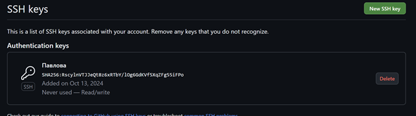

---
## Front matter
title: "Отчёт по лабораторной работе №2"
subtitle: "Дисциплина: Архитектура компьютера"
author: "Павлова Татьяна Юрьевна"

## Generic otions
lang: ru-RU
toc-title: "Содержание"

## Bibliography
bibliography: bib/cite.bib
csl: pandoc/csl/gost-r-7-0-5-2008-numeric.csl

## Pdf output format
toc: true # Table of contents
toc-depth: 2
lof: true # List of figures
lot: true # List of tables
fontsize: 12pt
linestretch: 1.5
papersize: a4
documentclass: scrreprt
## I18n polyglossia
polyglossia-lang:
  name: russian
  options:
	- spelling=modern
	- babelshorthands=true
polyglossia-otherlangs:
  name: english
## I18n babel
babel-lang: russian
babel-otherlangs: english
## Fonts
mainfont: IBM Plex Serif
romanfont: IBM Plex Serif
sansfont: IBM Plex Sans
monofont: IBM Plex Mono
mathfont: STIX Two Math
mainfontoptions: Ligatures=Common,Ligatures=TeX,Scale=0.94
romanfontoptions: Ligatures=Common,Ligatures=TeX,Scale=0.94
sansfontoptions: Ligatures=Common,Ligatures=TeX,Scale=MatchLowercase,Scale=0.94
monofontoptions: Scale=MatchLowercase,Scale=0.94,FakeStretch=0.9
mathfontoptions:
## Biblatex
biblatex: true
biblio-style: "gost-numeric"
biblatexoptions:
  - parentracker=true
  - backend=biber
  - hyperref=auto
  - language=auto
  - autolang=other*
  - citestyle=gost-numeric
## Pandoc-crossref LaTeX customization
figureTitle: "Рис."
tableTitle: "Таблица"
listingTitle: "Листинг"
lofTitle: "Список иллюстраций"
lotTitle: "Список таблиц"
lolTitle: "Листинги"
## Misc options
indent: true
header-includes:
  - \usepackage{indentfirst}
  - \usepackage{float} # keep figures where there are in the text
  - \floatplacement{figure}{H} # keep figures where there are in the text
---

# Цель работы

Целью данной работы является изучение идеологии и применения средств контроля версий, а также приобретение практических навыков по работе с системой git.

# Задание

1. Настройка GitHub.
2. Базовая настройка Git.
3. Создание SSH-ключа.
4. Создание рабочего пространства и репозитория курса на основе шаблона.
5. Создание репозитория курса на основе шаблона.
6. Настройка каталога курса.
7. Выполнение заданий для самостоятельной работы.

# Теоретическое введение

##Системы контроля версий. Общие понятия

Системы контроля версий (Version Control System, VCS) применяются при работе нескольких человек над одним проектом. Обычно основное дерево проекта хранится в локальном или удалённом репозитории, к которому настроен доступ для участников проекта. При внесении изменений в содержание проекта система контроля версий позволяет их фиксировать, совмещать изменения, произведённые разными участниками проекта, производить откат к любой более ранней версии проекта, если это требуется.
В классических системах контроля версий используется централизованная модель, предполагающая наличие единого репозитория для хранения файлов. Выполнение большинства функций по управлению версиями осуществляется специальным сервером. Участник проекта (пользователь) перед началом работы посредством определённых команд получает нужную ему версию файлов. После внесения изменений, пользователь размещает новую версию в хранилище. При этом предыдущие версии не удаляются из центрального хранилища и к ним можно вернуться в любой момент. Сервер может сохранять не полную версию изменённых файлов, а производить так называемую дельта-компрессию — сохранять только изменения между последовательными версиями, что позволяет уменьшить объём хранимых  данных.
Системы контроля версий поддерживают возможность отслеживания и разрешения конфликтов, которые могут возникнуть при работе нескольких человек над одним файлом. Можно объединить (слить) изменения, сделанные разными участниками (автоматически или вручную), вручную выбрать нужную версию, отменить изменения вовсе или заблокировать файлы для изменения. В зависимости от настроек блокировка не позволяет другим пользователям получить рабочую копию или препятствует изменению рабочей копии файла средствами файловой системы ОС, обеспечивая таким образом, привилегированный доступ только одному пользователю, работающему с файлом.
Системы контроля версий также могут обеспечивать дополнительные, более гибкие функциональные возможности. Например, они могут поддерживать работу с несколькими версиями одного файла, сохраняя общую историю изменений до точки ветвления версий и собственные истории изменений каждой ветви. Кроме того, обычно доступна информация о том, кто из участников, когда и какие изменения вносил. Обычно такого рода информация хранится в журнале изменений, доступ к которому можно ограничить.
В отличие от классических, в распределённых системах контроля версий центральный репозиторий не является обязательным.
Среди классических VCS наиболее известны CVS, Subversion, а среди распределённых — Git, Bazaar, Mercurial. Принципы их работы схожи, отличаются они в основном синтаксисом используемых в работе команд.

##Система контроля версий Git

Система контроля версий Git представляет собой набор программ командной строки. Доступ к ним можно получить из терминала посредством ввода команды git с различными опциями.
Благодаря тому, что Git является распределённой системой контроля версий, резервную копию локального хранилища можно сделать простым копированием или архивацией.

# Выполнение лабораторной работы

##Настройка github

Существует несколько доступных серверов репозиториев с возможностью бесплатного размещения данных. Например, http://bitbucket.org/, https://github.com/ и https://gitflic.ru.
Для выполнения лабораторных работ предлагается использовать Github. Создайте учётную запись на сайте https://github.com/ и заполните основные данные. (рис. [-@fig:001]).

{#fig:001 width=70%}

##Базовая настройка git

Сначала сделаем предварительную конфигурацию git. Откройте терминал и введите следующие команды, указав имя и email владельца репозитория:
git config --global user.name "<Name Surname>"
git config --global user.email "<work@mail>" (рис. [-@fig:002]).

{#fig:002 width=70%}

Настроим utf-8 в выводе сообщений git:
git config --global core.quotepath false
Зададим имя начальной ветки (будем называть её master):
git config --global init.defaultBranch master (рис. [-@fig:003]).

{#fig:003 width=70%}

Параметр autocrlf:
git config --global core.autocrlf input
Параметр safecrlf:
git config --global core.safecrlf warn (рис. [-@fig:004]).

{#fig:004 width=70%}

##Создание SSH ключа

Для последующей идентификации пользователя на сервере репозиториев необходимо сгенерировать пару ключей (приватный и открытый):
ssh-keygen -C "Имя Фамилия <work@mail>" (рис. [-@fig:005]).

{#fig:005 width=70%}

Ключи сохраняться в каталоге ~/.ssh/. 
Далее необходимо загрузить сгенерённый открытый ключ. Для этого зайти на сайт http://github.org/ под своей учётной записью и перейти в меню Setting. После этого выбрать в боковом меню SSH and GPG keys и нажать кнопку New SSH key. Скопировав из локальной консоли ключ в буфер обмена
cat ~/.ssh/id_rsa.pub | xclip -sel clip
вставляем ключ в появившееся на сайте поле и указываем для ключа имя (Title). (рис. [-@fig:006]).

{#fig:006 width=70%}

##Сознание рабочего пространства и репозитория курса на основе шаблона

При выполнении лабораторных работ следует придерживаться структуры рабочего пространства. Рабочее пространство по предмету располагается в следующей иерархии:
~/work/study/
└── <учебный год>/
└── <название предмета>/
└── <код предмета>/
Например, для 2023–2024 учебного года и предмета «Архитектура компьютера» (код предмета arch-pc) структура каталогов примет следующий вид:
~/work/study/
└── 2023–2024/
└── Архитектура компьютера/ 
└── arch-pc/
└── labs/
└── lab01/
└── lab02/
└── lab03/
...
• Каталог для лабораторных работ имеет вид labs.
• Каталоги для лабораторных работ имеют вид lab<номер>, например: lab01, lab02 и т.д.
Название проекта на хостинге git имеет вид: study_<учебный год>_<код предмета>
Например, для 2023–2024 учебного года и предмета «Архитектура компьютера» (код предмета arch-pc) название проекта примет следующий вид: study_2023–2024_arch-pc
Откройте терминал и создайте каталог для предмета «Архитектура компьютера» (рис. [-@fig:007]).

{#fig:007 width=70%}

##Сознание репозитория курса на основе шаблона

Репозиторий на основе шаблона можно создать через web-интерфейс github. Перейдите на станицу репозитория с шаблоном курса https://github.com/yamadharma/course-directory-student-template. Далее выберите Use this template. (рис. [-@fig:008]).

{#fig:008 width=70%}

В открывшемся окне задайте имя репозитория (Repository name) study_2023 2024_arhpc и создайте репозиторий (кнопка Create repository from template). (рис. [-@fig:009]).

{#fig:009 width=70%}

В открывшемся окне задайте имя репозитория (Repository name) study_2023–2024_arhpc и создайте репозиторий (кнопка Create repository from template).
Откройте терминал и перейдите в каталог курса:
cd ~/work/study/2023–2024/"Архитектура компьютера"
клонируйте созданный репозиторий:
git clone --recursive git@github.com:<user_name>/study_2023–2024_arh-pc.git
↪ arch-pc 
У меня возникли проблемы с клонированием репозитория с помощью SSH, поэтому я сделала это с помощью HTTPS. (рис. [-@fig:010]).

{#fig:010 width=70%}

##Настройка каталога курса

Перейдите в каталог курса:
cd ~/work/study/2023-2024/"Архитектура компьютера"/arch-pc
Удалите лишние файлы:
rm package.json
Создайте необходимые каталоги:
echo arch-pc > COURSE
make (рис. [-@fig:011]).

{#fig:011 width=70%}

Отправьте файлы на сервер:
git add .
git commit -am 'feat(main): make course structure' (рис. [-@fig:012]).

{#fig:012 width=70%}

git push (рис. [-@fig:013]).

{#fig:013 width=70%}

Проверьте правильность создания иерархии рабочего пространства в локальном репозитории и на странице github. (рис. [-@fig:014]).

{#fig:014 width=70%}

# Выполнение заданий для самостоятельной работы

Перехожу в подкаталог lab01/report с помощью утилиты cd (рис. [-@fig:015]).

{#fig:015 width=70%}

Проверяю местонахождение файлов с отчетами по первой лабораторной работе. Они должны быть в подкаталоге домашней директории «Загрузки», для проверки использую команду ls (рис. [-@fig:016]).

{#fig:016 width=70%} 

Копирую первую лабораторную с помощью утилиты cp и проверяю правильность выполнения команды cp с помощью ls (рис. [-@fig:017]).

{#fig:017 width=70%}

Добавляю с помощью команды git add в коммит файл: Л01_Павлова_отчет (рис. [-@fig:018]).

{#fig:018 width=70%}

Сохраняю изменения на сервере командой git commit -m “…”, поясняя, что добавила файлы (рис. [-@fig:019]).

{#fig:019 width=70%}

Отправляю в центральный репозиторий сохраненные изменения командой git push -f origin master (рис. [-@fig:020]).

{#fig:020 width=70%}

Проверяю на сайте GitHub правильность выполнения заданий (рис. [-@fig:021]).

{#fig:021 width=70%}

# Выводы

При выполнении данной лабораторной работы я изучила идеологию и применение средств контроля версий, а также приобрела практические навыки по работе с системой git.

# Список литературы{.unnumbered}

GDB: The GNU Project Debugger. — URL: https://www.gnu.org/software/gdb/. 
GNU Bash Manual. — 2016. — URL: https://www.gnu.org/software/bash/manual/. 
Midnight Commander Development Center. — 2021. — URL: https://midnight-commander. org/. 
NASM Assembly Language Tutorials. — 2021. — URL: https://asmtutor.com/. 
Newham C. Learning the bash Shell: Unix Shell Programming. — O’Reilly Media, 2005. — 354 с. — (In a Nutshell). — ISBN 0596009658. — URL: http://www.amazon.com/Learningbash-Shell-Programming-Nutshell/dp/0596009658. 
Robbins A. Bash Pocket Reference. — O’Reilly Media, 2016. — 156 с. — ISBN 978-1491941591. 
The NASM documentation. — 2021. — URL: https://www.nasm.us/docs.php. 
Zarrelli G. Mastering Bash. — Packt Publishing, 2017. — 502 с. — ISBN 9781784396879. 
Колдаев В. Д., Лупин С. А. Архитектура ЭВМ. — М. : Форум, 2018. 
Куляс О. Л., Никитин К. А. Курс программирования на ASSEMBLER. — М. : Солон-Пресс, 2017. 
Новожилов О. П. Архитектура ЭВМ и систем. — М. : Юрайт, 2016. 
Расширенный ассемблер: NASM. — 2021. — URL: https://www.opennet.ru/docs/RUS/nasm/. 
Робачевский А., Немнюгин С., Стесик О. Операционная система UNIX. — 2-е изд. — БХВПетербург, 2010. — 656 с. — ISBN 978-5-94157-538-1. 
Столяров А. Программирование на языке ассемблера NASM для ОС Unix. — 2-е изд. — М. : МАКС Пресс, 2011. — URL: http://www.stolyarov.info/books/asm_unix. 
Таненбаум Э. Архитектура компьютера. — 6-е изд. — СПб. : Питер, 2013. — 874 с. — (Классика Computer Science). 

