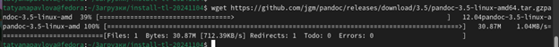

---
## Front matter
title: "Отчёт по лабораторной работе №3"
subtitle: "Дисциплина: Архитектура компьютера"
author: "Павлова Татьяна Юрьевна"

## Generic otions
lang: ru-RU
toc-title: "Содержание"

## Bibliography
bibliography: bib/cite.bib
csl: pandoc/csl/gost-r-7-0-5-2008-numeric.csl

## Pdf output format
toc: true # Table of contents
toc-depth: 2
lof: true # List of figures
lot: true # List of tables
fontsize: 12pt
linestretch: 1.5
papersize: a4
documentclass: scrreprt
## I18n polyglossia
polyglossia-lang:
  name: russian
  options:
	- spelling=modern
	- babelshorthands=true
polyglossia-otherlangs:
  name: english
## I18n babel
babel-lang: russian
babel-otherlangs: english
## Fonts
mainfont: IBM Plex Serif
romanfont: IBM Plex Serif
sansfont: IBM Plex Sans
monofont: IBM Plex Mono
mathfont: STIX Two Math
mainfontoptions: Ligatures=Common,Ligatures=TeX,Scale=0.94
romanfontoptions: Ligatures=Common,Ligatures=TeX,Scale=0.94
sansfontoptions: Ligatures=Common,Ligatures=TeX,Scale=MatchLowercase,Scale=0.94
monofontoptions: Scale=MatchLowercase,Scale=0.94,FakeStretch=0.9
mathfontoptions:
## Biblatex
biblatex: true
biblio-style: "gost-numeric"
biblatexoptions:
  - parentracker=true
  - backend=biber
  - hyperref=auto
  - language=auto
  - autolang=other*
  - citestyle=gost-numeric
## Pandoc-crossref LaTeX customization
figureTitle: "Рис."
tableTitle: "Таблица"
listingTitle: "Листинг"
lofTitle: "Список иллюстраций"
lotTitle: "Список таблиц"
lolTitle: "Листинги"
## Misc options
indent: true
header-includes:
  - \usepackage{indentfirst}
  - \usepackage{float} # keep figures where there are in the text
  - \floatplacement{figure}{H} # keep figures where there are in the text
---

# Цель работы

Целью данной работы является  освоение процедуры оформления отчетов с помощью легковесного языка разметки Markdown.

# Задание

1. Установка необходимого ПО
2. Заполнение отчета по выполнению лабораторной работы №4 с помощью языка разметки Markdown
3. Задание для самостоятельной работы

# Теоретическое введение

Markdown - легковесный язык разметки, созданный с целью обозначения форматирования в простом тексте, с максимальным сохранением его читаемости человеком, и пригодный для машинного преобразования в языки для продвинутых публикаций. 
Внутритекстовые формулы делаются аналогично формулам LaTeX.
В Markdown вставить изображение в документ можно с помощью непосредственного указания адреса изображения.
Синтаксис Markdown для встроенной ссылки состоит из части [link text], представляющей текст гиперссылки, и части (file-name.md) – URL-адреса или имени файла, на который дается ссылка.
Markdown поддерживает как встраивание фрагментов кода в предложение, так и их размещение между предложениями в виде отдельных огражденных блоков. Огражденные блоки кода — это простой способ выделить синтаксис для фрагментов кода.

# Выполнение лабораторной работы

## Установление необходимого ПО

### Установка TexLive

Скачала TexLive с официального сайта. Распаковываю архив. (рис. [-@fig:001])

{ #fig:001 width=70% }

Перехожу в распакованную папку с помощью cd. Запускаю скрипт install-tl-* с правами root, используя sudo в начале команды. (рис. [-@fig:002])

{ #fig:002 width=70% }

Добавляю /usr/local/texlive/2024/bin/x86_64-linux в свой PATH для текущей и будущих сессий. (рис. [-@fig:003])

{ #fig:003 width=70% }

### Установка pandoc и pandoc-crossref

Скачиваю архив pandoc версии 3.4. (рис. [-@fig:004])

{ #fig:004 width=70% }

Скачиваю архив pandoc-crossref 0.3.18.0. (рис. [-@fig:005])

{ #fig:005 width=70% }

Распаковываю скачанные архивы. (рис. [-@fig:006])

{ #fig:006 width=70% }

Копирую файлы pandoc и pandoc-crossref в каталог /usr/local/bin/ с правами пользователя root с помощью sudo. (рис. [-@fig:007])

{ #fig:007 width=70% }

Проверяю корректность выполненных действий (рис. [-@fig:008])

{ #fig:008 width=70% }

###Выполнение лабораторной работы

Откройте терминал. 
Перейдите в каталог курса сформированный при выполнении лабораторной работы №2 
Обновите локальный репозиторий, скачав изменения из удаленного репозитория с помощью команды. (рис. [-@fig:009])

{ #fig:009 width=70% }

Перейдите в каталог с шаблоном отчета по лабораторной работе № 3 Проведите компиляцию шаблона с использованием Makefile. Для этого введите команду make. (рис. [-@fig:010])

{ #fig:010 width=70% }

При успешной компиляции должны сгенерироваться файлы report.pdf и report.docx.
Откройте и проверьте корректность полученных файлов. (рис. [-@fig:011])

{ #fig:011 width=70% }

(рис. [-@fig:012])

{ #fig:012 width=70% }

Удалите полученные файлы с использованием Makefile, введя команду make clean. С помощью команды ls проверьте, удалились ли созданные файлы. (рис. [-@fig:013])

{ #fig:013 width=70% }

Откройте файл report.md с помощью любого текстового редактора mousepad. (рис. [-@fig:014])

{ #fig:014 width=70% }

Чтобы на всякий случай сохранился шаблон отчета, скопируйте файл с новым названием с помощью утилиты cp. (рис. [-@fig:015])

{ #fig:015 width=70% }

Начните заполнять отчет с помощью языка разметки Markdown в скопированном файле. (рис. [-@fig:016])

{ #fig:016 width=70% }

## Задание для самостоятельной работы

1. В соответствующем каталоге сделайте отчёт по лабораторной работе № 2 в формате Markdown. В качестве отчёта необходимо предоставить отчёты в 3 форматах: pdf, docx и md.

Перехожу в директорию lab02/report с помощью cd, чтобы там заполнять отчет по третьей лабораторной работе. (рис. [-@fig:017])

{ #fig:017 width=70% }

Копирую файл report.md с новым именем для заполнения отчета. (рис. [-@fig:018])

{ #fig:018 width=70% }

Открываю файл с помощью текстового редактора mousepad и начинаю заполнять отчет. (рис. [-@fig:019])

{ #fig:019 width=70% }

Удаляю предыдущий файл отчета, чтобы при компиляции он мне не мешал. (рис. [-@fig:020])

{ #fig:020 width=70% }

Компилирую файл с отчетом по лабораторной работе. (рис. [-@fig:021])

{ #fig:021 width=70% }

2. Загрузите файлы на github

Удаляю лишние сгенерированные файлы report.docx и report.pdf (рис. [-@fig:022])

{ #fig:022 width=70% }

Добавляю изменения на GitHub с помощью командой git add и сохраняю изменения с помощью commit (рис. [-@fig:023])

{ #fig:023 width=70% }

Отправляю файлы на сервер с помощью команды git push (рис. [-@fig:024])

{ #fig:024 width=70% }

# Выводы

В результате выполнения данной лабораторной работы я освоила процедуры оформления отчетов с помощью легковесного языка разметки Markdown.

# Список литературы{.unnumbered}

1. GDB: The GNU Project Debugger. — URL: https://www.gnu.org/software/gdb/. 
2. GNU Bash Manual. — 2016. — URL: https://www.gnu.org/software/bash/manual/. 
3. Midnight Commander Development Center. — 2021. — URL: https://midnight-commander. org/. 
4. NASM Assembly Language Tutorials. — 2021. — URL: https://asmtutor.com/. 
5. Newham C. Learning the bash Shell: Unix Shell Programming. — O’Reilly Media, 2005. — 354 с. — (In a Nutshell). — ISBN 0596009658. — URL: http://www.amazon.com/Learningbash-Shell-Programming-Nutshell/dp/0596009658. 
6. Robbins A. Bash Pocket Reference. — O’Reilly Media, 2016. — 156 с. — ISBN 978-1491941591. 
7. The NASM documentation. — 2021. — URL: https://www.nasm.us/docs.php. 
8. Zarrelli G. Mastering Bash. — Packt Publishing, 2017. — 502 с. — ISBN 9781784396879. 
9. Колдаев В. Д., Лупин С. А. Архитектура ЭВМ. — М. : Форум, 2018. 
10. Куляс О. Л., Никитин К. А. Курс программирования на ASSEMBLER. — М. : Солон-Пресс, 2017. 
11. Новожилов О. П. Архитектура ЭВМ и систем. — М. : Юрайт, 2016. 
12. Расширенный ассемблер: NASM. — 2021. — URL: https://www.opennet.ru/docs/RUS/nasm/.
 13. Робачевский А., Немнюгин С., Стесик О. Операционная система UNIX. — 2-е изд. — БХВПетербург, 2010. — 656 с. — ISBN 978-5-94157-538-1. 
14. Столяров А. Программирование на языке ассемблера NASM для ОС Unix. — 2-е изд. — М. : МАКС Пресс, 2011. — URL: http://www.stolyarov.info/books/asm_unix. 
15. Таненбаум Э. Архитектура компьютера. — 6-е изд. — СПб. : Питер, 2013. — 874 с. — (Классика Computer Science). 
16. Таненбаум Э., Бос Х. Современные операционные системы. — 4-е изд. — СПб. : Питер, 2015. — 1120 с. — (Классика Computer Science).
17. Архитектура ЭВМ
