---
## Front matter
title: "Отчёт по лабораторной работе №4"
subtitle: "Дисциплина: Архитектура компьютера"
author: "Павлова Татьяна Юрьевна"

## Generic otions
lang: ru-RU
toc-title: "Содержание"

## Bibliography
bibliography: bib/cite.bib
csl: pandoc/csl/gost-r-7-0-5-2008-numeric.csl

## Pdf output format
toc: true # Table of contents
toc-depth: 2
lof: true # List of figures
lot: true # List of tables
fontsize: 12pt
linestretch: 1.5
papersize: a4
documentclass: scrreprt
## I18n polyglossia
polyglossia-lang:
  name: russian
  options:
	- spelling=modern
	- babelshorthands=true
polyglossia-otherlangs:
  name: english
## I18n babel
babel-lang: russian
babel-otherlangs: english
## Fonts
mainfont: IBM Plex Serif
romanfont: IBM Plex Serif
sansfont: IBM Plex Sans
monofont: IBM Plex Mono
mathfont: STIX Two Math
mainfontoptions: Ligatures=Common,Ligatures=TeX,Scale=0.94
romanfontoptions: Ligatures=Common,Ligatures=TeX,Scale=0.94
sansfontoptions: Ligatures=Common,Ligatures=TeX,Scale=MatchLowercase,Scale=0.94
monofontoptions: Scale=MatchLowercase,Scale=0.94,FakeStretch=0.9
mathfontoptions:
## Biblatex
biblatex: true
biblio-style: "gost-numeric"
biblatexoptions:
  - parentracker=true
  - backend=biber
  - hyperref=auto
  - language=auto
  - autolang=other*
  - citestyle=gost-numeric
## Pandoc-crossref LaTeX customization
figureTitle: "Рис."
tableTitle: "Таблица"
listingTitle: "Листинг"
lofTitle: "Список иллюстраций"
lotTitle: "Список таблиц"
lolTitle: "Листинги"
## Misc options
indent: true
header-includes:
  - \usepackage{indentfirst}
  - \usepackage{float} # keep figures where there are in the text
  - \floatplacement{figure}{H} # keep figures where there are in the text
---

# Цель работы

Целью данной работы является освоить процедуры компиляции и сборки программ, написанных на ассемблере NASM.

# Задание

1.	Создание программы Hello world!
2.	Работа с транслятором NASM
3.	Работа с расширенным синтаксисом командной строки NASM
4.	Работа с компоновщиком LD
5.	Запуск исполняемого файла
6.	Выполнение заданий для самостоятельной работы.

# Теоретическое введение

## Основные принципы работы компьютера

Основными функциональными элементами любой электронно-вычислительной машины (ЭВМ) являются центральный процессор, память и периферийные устройства (рис. 4.1).
Взаимодействие этих устройств осуществляется через общую шину, к которой они подключены. Физически шина представляет собой большое количество проводников, соединяющих устройства друг с другом. В современных компьютерах проводники выполнены в виде электропроводящих дорожек на материнской (системной) плате.
Основной задачей процессора является обработка информации, а также организация координации всех узлов компьютера. В состав центрального процессора (ЦП) входят следующие устройства:
• арифметико-логическое устройство (АЛУ) — выполняет логические и арифметические действия, необходимые для обработки информации, хранящейся в памяти;
• устройство управления (УУ) — обеспечивает управление и контроль всех устройств
компьютера;
• регистры — сверхбыстрая оперативная память небольшого объёма, входящая в состав процессора, для временного хранения промежуточных результатов выполнения
инструкций; регистры процессора делятся на два типа: регистры общего назначения и
специальные регистры.
Для того, чтобы писать программы на ассемблере, необходимо знать, какие регистры процессора существуют и как их можно использовать. Большинство команд в программах написанных на ассемблере используют регистры в качестве операндов. Практически все команды представляют собой преобразование данных хранящихся в регистрах процессора, это например пересылка данных между регистрами или между регистрами и памятью, преобразование (арифметические или логические операции) данных хранящихся в регистрах.
Доступ к регистрам осуществляется не по адресам, как к основной памяти, а по именам.
Каждый регистр процессора архитектуры x86 имеет свое название, состоящее из 2 или 3 букв латинского алфавита.
В качестве примера приведем названия основных регистров общего назначения (именно эти регистры чаще всего используются при написании программ):
• RAX, RCX, RDX, RBX, RSI, RDI — 64-битные
• EAX, ECX, EDX, EBX, ESI, EDI — 32-битные
• AX, CX, DX, BX, SI, DI — 16-битные
• AH, AL, CH, CL, DH, DL, BH, BL — 8-битные (половинки 16-битных регистров). Например, AH (high AX) — старшие 8 бит регистра AX, AL (low AX) — младшие 8 бит регистра AX.

# Выполнение лабораторной работы

## Программа Hello world!

Рассмотрим пример простой программы на языке ассемблера NASM. Традиционно первая
программа выводит приветственное сообщение Hello world! на экран.
Создайте каталог для работы с программами на языке ассемблера NASM (рис. [-@fig:001]).

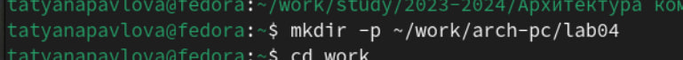{#fig:001 width=70%}

Перейдите в созданный каталог (рис. [-@fig:002]).

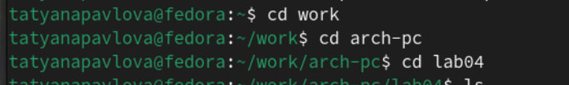{#fig:002 width=70%}

Создайте текстовый файл с именем hello.asm (рис. [-@fig:003]).

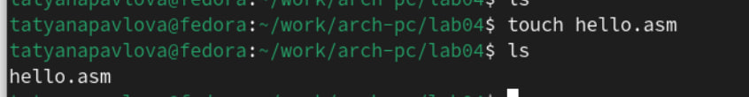{#fig:003 width=70%}

откройте этот файл с помощью любого текстового редактора, например, gedit (рис. [-@fig:004]).

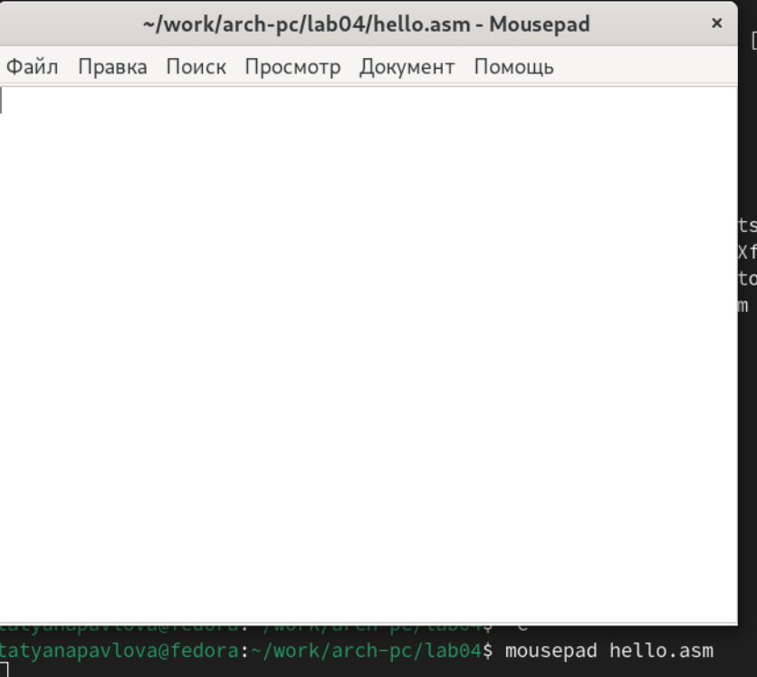{#fig:004 width=70%}

Заполните файл, вставив в него программу для вывода “Hello word!” (рис. [-@fig:005]).

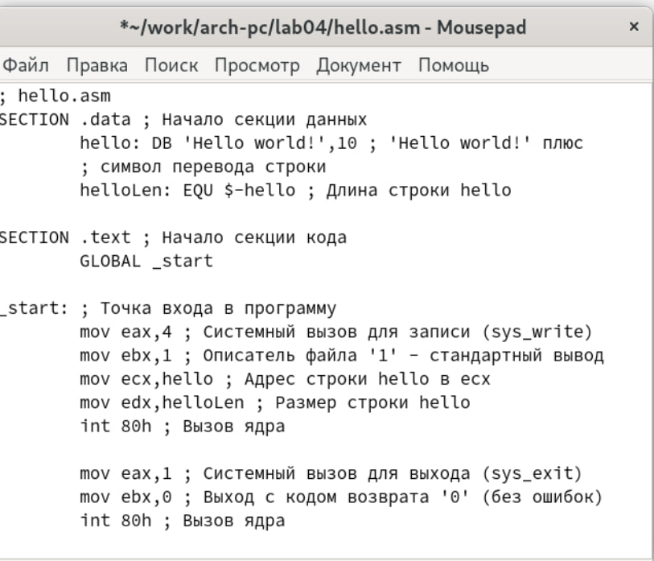{#fig:005 width=70%}

## Транслятор NASM

NASM превращает текст программы в объектный код. Например, для компиляции приведённого выше текста программы «Hello World» необходимо написать: nasm -f elf hello.asm
Если текст программы набран без ошибок, то транслятор преобразует текст программы из файла hello.asm в объектный код, который запишется в файл hello.o. Таким образом, имена всех файлов получаются из имени входного файла и расширения по умолчанию.
При наличии ошибок объектный файл не создаётся, а после запуска транслятора появятся сообщения об ошибках или предупреждения.
С помощью команды ls проверьте, что объектный файл был создан. Какое имя имеет объектный файл?
NASM не запускают без параметров. Ключ -f указывает транслятору, что требуется создать бинарные файлы в формате ELF. Следует отметить, что формат elf64 позволяет создавать исполняемый код, работающий под 64-битными версиями Linux. Для 32-битных версий ОС указываем в качестве формата просто elf. 
NASM всегда создаёт выходные файлы в текущем каталоге. (рис. [-@fig:006]).

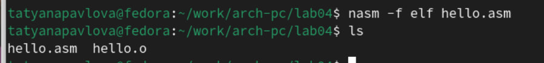{#fig:006 width=70%}

Полный вариант командной строки nasm выглядит следующим образом:
nasm [-@ косвенный_файл_настроек] [-o объектный_файл] [-f
↪ формат_объектного_файла] [-l листинг] [параметры...] [--] исходный_файл
Выполните следующую команду:
nasm -o obj.o -f elf -g -l list.lst hello.asm 

Данная команда скомпилирует исходный файл hello.asm в obj.o (опция -o позволяет задать имя объектного файла, в данном случае obj.o), при этом формат выходного файла будет elf, и в него будут включены символы для отладки (опция -g), кроме того, будет создан файл листинга list.lst (опция -l).
С помощью команды ls проверьте, что файлы были созданы. (рис. [-@fig:007]).

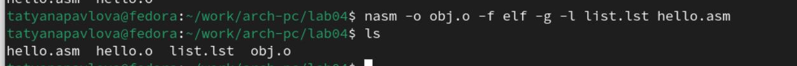{#fig:007 width=70%}

## Компоновщик LD

Как видно из схемы на рис. 4.3, чтобы получить исполняемую программу, объектный файл необходимо передать на обработку компоновщику:
ld -m elf_i386 hello.o -o hello
С помощью команды ls проверьте, что исполняемый файл hello был создан. (рис. [-@fig:008]).

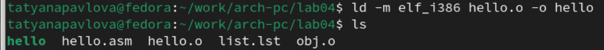{#fig:008 width=70%}

Компоновщик ld не предполагает по умолчанию расширений для файлов, но принято
использовать следующие расширения:
• o – для объектных файлов;
• без расширения – для исполняемых файлов;
• map – для файлов схемы программы;
• lib – для библиотек.
Ключ -o с последующим значением задаёт в данном случае имя создаваемого исполняемого файла.
Выполните следующую команду:
ld -m elf_i386 obj.o -o main (рис. [-@fig:009]).

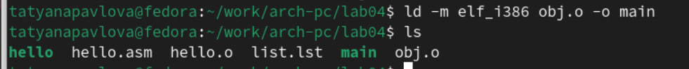{#fig:009 width=70%}

Исполняемый файл будет иметь имя main, т.к. после ключа -о было задано значение main. Объектный файл, из которого собран этот исполняемый файл, имеет имя obj.o

## Запуск исполняемого файла

Запустить на выполнение созданный исполняемый файл, находящийся в текущем каталоге, можно, набрав в командной строке:
./hello (рис. [-@fig:010]).

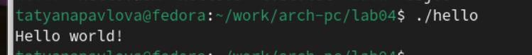{#fig:010 width=70%}

# Задание для самостоятельной работы

1. С помощью утилиты cp создаю в текущем каталоге копию файла hello.asm с именем lab4.asm (рис. [-@fig:011]).

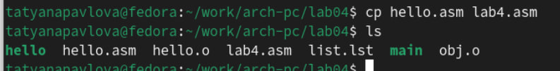{#fig:011 width=70%}

2. С помощью текстового редактора mousepad открываю файл lab4.asm и вношу изменения в программу так, чтобы она выводила мои имя и фамилию. (рис. [-@fig:012]).

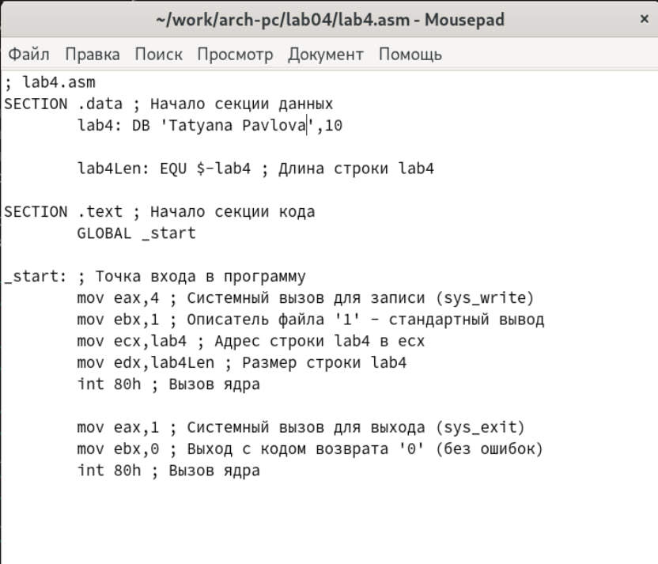{#fig:012 width=70%}

3. Компилирую текст программы в объектный файл. Проверяю с помощью утилиты ls, что файл lab4.o создан. (рис. [-@fig:013]).

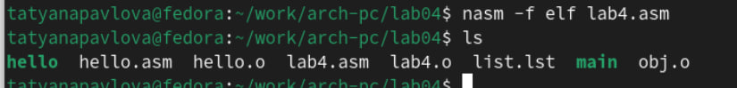{#fig:013 width=70%}

Передаю объектный файл lab4.o на обработку компоновщику LD, чтобы получить исполняемый файл lab4 (рис. [-@fig:014]).

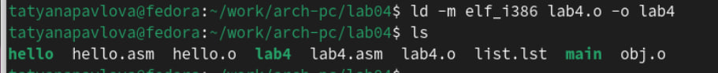{#fig:014 width=70%}

Запускаю исполняемый файл lab4, на экран действительно выводятся мои имя и фамилия (рис. [-@fig:015]).

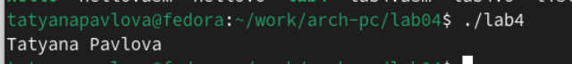{#fig:015 width=70%}

4. Далее копирую из текущего каталога файлы, созданные в процессе выполнения лабораторной работы, с помощью утилиты cp, указывая вместо имени файла символ *, чтобы скопировать все файлы. Команда проигнорирует директории в этом каталоге, т. к. не указан ключ -r, это мне и нужно (рис. 4.15). Проверяю с помощью утилиты ls правильность выполнения команды. (рис. [-@fig:016]).

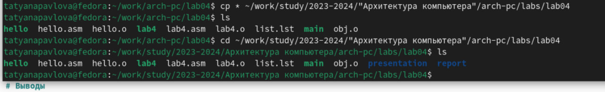{#fig:016 width=70%}

С помощью команд git add . и git commit добавляю файлы на GitHub, комментируя действие как добавление файлов для лабораторной работы №4 и отправляю файлы на сервер с помощью команды git push (рис. [-@fig:017]).

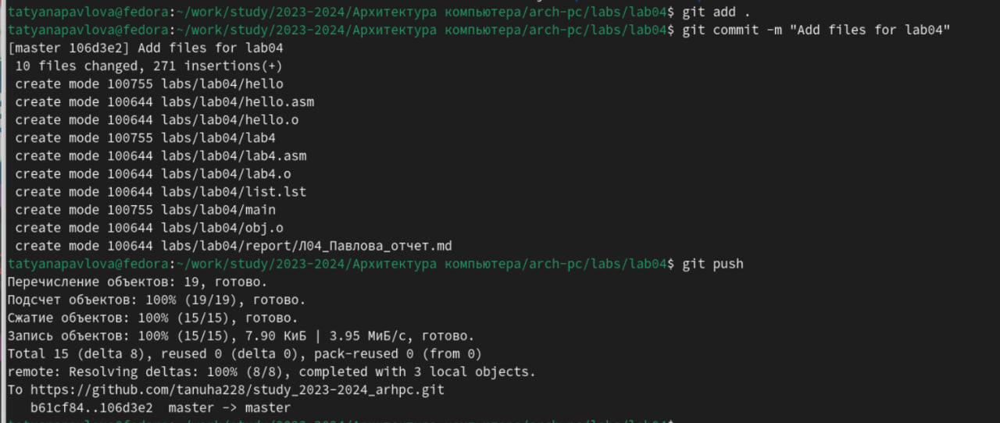{#fig:017 width=70%}

# Выводы

При выполнении данной лабораторной работы я освоила процедуры компиляции и сборки программ, написанных на ассемблере NASM.

# Список литературы{.unnumbered}

1. GDB: The GNU Project Debugger. — URL: https://www.gnu.org/software/gdb/. 
2. GNU Bash Manual. — 2016. — URL: https://www.gnu.org/software/bash/manual/. 
3. Midnight Commander Development Center. — 2021. — URL: https://midnight-commander. org/. 
4. NASM Assembly Language Tutorials. — 2021. — URL: https://asmtutor.com/. 
5. Newham C. Learning the bash Shell: Unix Shell Programming. — O’Reilly Media, 2005. — 354 с. — (In a Nutshell). — ISBN 0596009658. — URL: http://www.amazon.com/Learningbash-Shell-Programming-Nutshell/dp/0596009658. 

