---
## Front matter
title: "Отчёт по лабораторной работе №6"
subtitle: "Дисциплина: Архитектура компьютера"
author: "Павлова Татьяна Юрьевна"

## Generic otions
lang: ru-RU
toc-title: "Содержание"

## Bibliography
bibliography: bib/cite.bib
csl: pandoc/csl/gost-r-7-0-5-2008-numeric.csl

## Pdf output format
toc: true # Table of contents
toc-depth: 2
lof: true # List of figures
lot: true # List of tables
fontsize: 12pt
linestretch: 1.5
papersize: a4
documentclass: scrreprt
## I18n polyglossia
polyglossia-lang:
  name: russian
  options:
	- spelling=modern
	- babelshorthands=true
polyglossia-otherlangs:
  name: english
## I18n babel
babel-lang: russian
babel-otherlangs: english
## Fonts
mainfont: IBM Plex Serif
romanfont: IBM Plex Serif
sansfont: IBM Plex Sans
monofont: IBM Plex Mono
mathfont: STIX Two Math
mainfontoptions: Ligatures=Common,Ligatures=TeX,Scale=0.94
romanfontoptions: Ligatures=Common,Ligatures=TeX,Scale=0.94
sansfontoptions: Ligatures=Common,Ligatures=TeX,Scale=MatchLowercase,Scale=0.94
monofontoptions: Scale=MatchLowercase,Scale=0.94,FakeStretch=0.9
mathfontoptions:
## Biblatex
biblatex: true
biblio-style: "gost-numeric"
biblatexoptions:
  - parentracker=true
  - backend=biber
  - hyperref=auto
  - language=auto
  - autolang=other*
  - citestyle=gost-numeric
## Pandoc-crossref LaTeX customization
figureTitle: "Рис."
tableTitle: "Таблица"
listingTitle: "Листинг"
lofTitle: "Список иллюстраций"
lotTitle: "Список таблиц"
lolTitle: "Листинги"
## Misc options
indent: true
header-includes:
  - \usepackage{indentfirst}
  - \usepackage{float} # keep figures where there are in the text
  - \floatplacement{figure}{H} # keep figures where there are in the text
---

# Цель работы

Целью данной работы является освоение арифметических инструкций языка ассемблера NASM

# Задание

1. Символьные и численные данные в NASM
2. Выполнение арифметических операций в NASM
3. Выполнение заданий для самостоятельной работы

# Теоретическое введение

    Большинство инструкций на языке ассемблера требуют обработки операндов. Адрес операнда предоставляет место, где хранятся данные, подлежащие обработке. Это могут быть данные хранящиеся в регистре или в ячейке памяти. 
•	Регистровая адресация – операнды хранятся в регистрах и в команде используются имена этих регистров, например: mov ax,bx.
•	Непосредственная адресация – значение операнда задается непосредственно в команде, Например: mov ax,2.
•	Адресация памяти – операнд задает адрес в памяти. В команде указывается символическое обозначение ячейки памяти, над содержимым которой требуется выполнить операцию.
    Ввод информации с клавиатуры и вывод её на экран осуществляется в символьном виде. Кодирование этой информации производится согласно кодовой таблице символов ASCII. ASCII – сокращение от American Standard Code for Information Interchange (Американский стандартный код для обмена информацией). Согласно стандарту ASCII каждый символ кодируется одним байтом. 
	Среди инструкций NASM нет такой, которая выводит числа (не в символьном виде). Поэтому, например, чтобы вывести число, надо предварительно преобразовать его цифры в ASCII-коды этих цифр и выводить на экран эти коды, а не само число. Если же выводить число на экран непосредственно, то экран воспримет его не как число, а как последовательность ASCII-символов – каждый байт числа будет воспринят как один ASCII-символ – и выведет на экран эти символы. 
	Аналогичная ситуация происходит и при вводе данных с клавиатуры. Введенные данные будут представлять собой символы, что сделает невозможным получение корректного результата при выполнении над ними арифметических операций. Для решения этой проблемы необходимо проводить преобразование ASCII символов в числа и обратно.

# Выполнение лабораторной работы

##Символьные и численные данные в NASM

Создайте каталог для программам лабораторной работы № 6, перейдите в него и создайте файл lab6-1.asm:
mkdir ~/work/arch-pc/lab06
cd ~/work/arch-pc/lab06
touch lab6-1.asm (рис. [-@fig:001]).

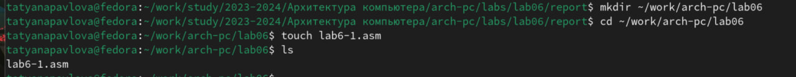{#fig:001 width=70%}

Рассмотрим примеры программ вывода символьных и численных значений. Программы будут выводить значения записанные в регистр eax.

ВАЖНО! Для корректной работы программы подключаемый файл in_out.asm должен лежать в том же каталоге, что и файл с текстом программы. Перед созданием исполняемого файла создайте копию файла in_out.asm в каталоге ~/work/arch-pc/lab06 (рис. [-@fig:002]).

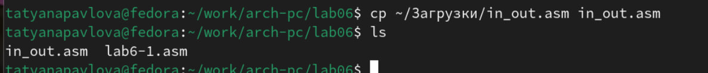{#fig:002 width=70%}

Введите в файл lab6-1.asm текст программы из листинга 6.1. В данной программе в регистр eax записывается символ 6 (mov eax,'6'), в регистр ebx символ 4 (mov ebx,'4').
Далее к значению в регистре eax прибавляем значение регистра ebx (add eax,ebx, результат сложения запишется в регистр eax). Далее выводим результат. Так как для работы функции sprintLF в регистр eax должен быть записан адрес, необходимо использовать дополнительную переменную. Для этого запишем значение регистра eax в переменную buf1 (mov [buf1],eax), а затем запишем адрес переменной buf1 в регистр eax (mov eax,buf1) и вызовем функцию sprintLF.

Создайте исполняемый файл и запустите его.
nasm -f elf lab6-1.asm
ld -m elf_i386 -o lab6-1 lab6-1.o
./lab6-1 (рис. [-@fig:003]).

{#fig:003 width=70%}

В данном случае при выводе значения регистра eax мы ожидаем увидеть число 10. Однако результатом будет символ j. Это происходит потому, что код символа 6 равен 00110110 в двоичном представлении (или 54 в десятичном представлении), а код символа 4 – 00110100 (52). Команда add eax,ebx запишет в регистр eax сумму кодов – 01101010 (106), что в свою очередь является кодом символа j.

Далее изменим текст программы и вместо символов, запишем в регистры числа. Исправьте текст программы (Листинг 6.1) следующим образом: замените строки
mov eax,'6'
mov ebx,'4'
на строки
mov eax,6
mov ebx,4 (рис. [-@fig:004]).

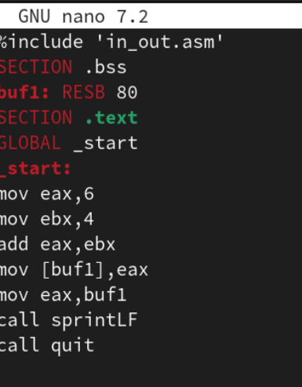{#fig:004 width=70%}

Создайте исполняемый файл и запустите его (рис. [-@fig:005]).

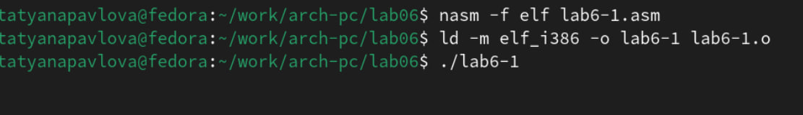{#fig:005 width=70%}

Как и в предыдущем случае при исполнении программы мы не получим число 10. В данном случае выводится символ с кодом 10. Это символ перевода строки, этот символ не отображается при выводе на экран.

Как отмечалось выше, для работы с числами в файле in_out.asm реализованы подпрограммы для преобразования ASCII символов в числа и обратно. Преобразуем текст программы из Листинга 6.1 с использованием этих функций.

Создайте файл lab6-2.asm в каталоге ~/work/arch-pc/lab06 и введите в него текст программы из листинга 6.2.
touch ~/work/arch-pc/lab06/lab6-2.asm (рис. [-@fig:006]).

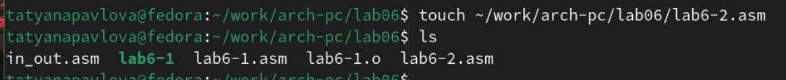{#fig:006 width=70%}

Создайте исполняемый файл и запустите его. (рис. [-@fig:007]).

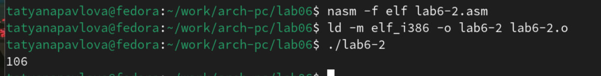{#fig:007 width=70%}

В результате работы программы мы получим число 106. В данном случае, как и в первом, команда add складывает коды символов ‘6’ и ‘4’ (54+52=106). Однако, в отличии от программы из листинга 6.1, функция iprintLF позволяет вывести число, а не символ, кодом которого является это число.

Аналогично предыдущему примеру изменим символы на числа. Замените строки
mov eax,'6'
mov ebx,'4'
на строки
mov eax,6
mov ebx,4 (рис. [-@fig:008]).

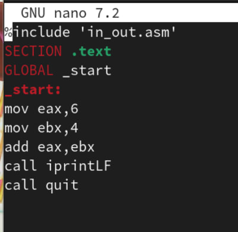{#fig:008 width=70%}

Создайте исполняемый файл и запустите его. (рис. [-@fig:009]).

{#fig:009 width=70%}

Теперь программа складывает не соответствующие символам коды в системе ASCII, а сами числа, поэтому вывод 10.

## Выполнение арифметических операций в NASM

В качестве примера выполнения арифметических операций в NASM приведем программу вычисления арифметического выражения 𝑓(𝑥) = (5 ∗ 2 + 3)/3.

Создайте файл lab6-3.asm в каталоге ~/work/arch-pc/lab06:
touch ~/work/arch-pc/lab06/lab6-3.asm (рис. [-@fig:010]).

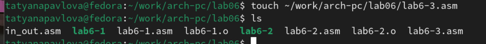{#fig:010 width=70%}

Внимательно изучите текст программы из листинга 6.3 и введите в lab6-3.asm. (рис. [-@fig:011]).

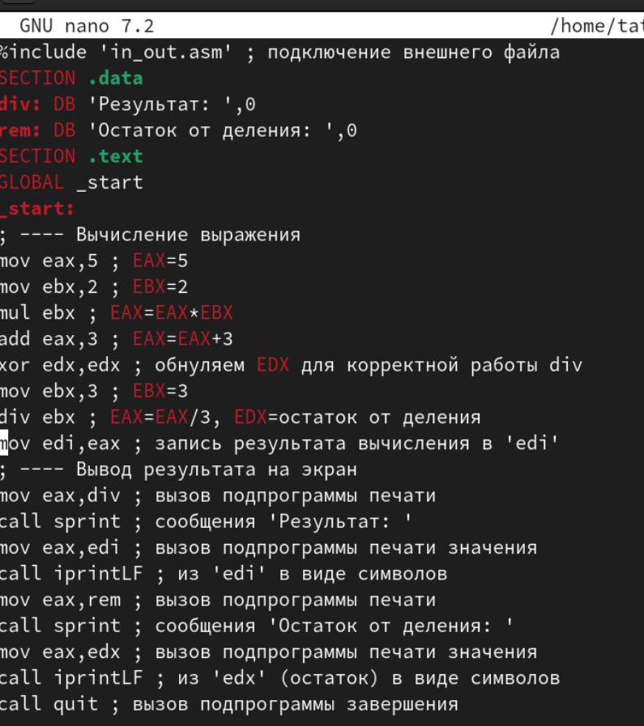{#fig:011 width=70%}

Создайте исполняемый файл и запустите его. Результат работы программы должен быть следующим:
user@dk4n31:~$ ./lab6-3
Результат: 4
Остаток от деления: 1
user@dk4n31:~$ (рис. [-@fig:012]).

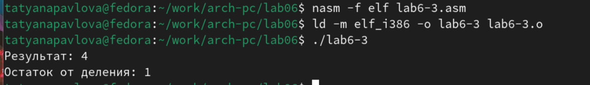{#fig:012 width=70%}

Измените текст программы для вычисления выражения 𝑓(𝑥) = (4 ∗ 6 + 2)/5. Создайте исполняемый файл и проверьте его работу. (рис. [-@fig:013]).

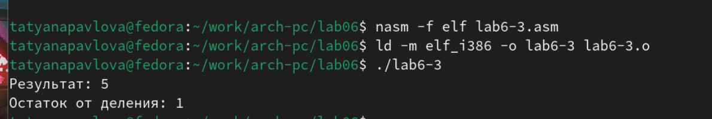{#fig:013 width=70%}

В качестве другого примера рассмотрим программу вычисления варианта задания по номеру студенческого билета, работающую по следующему алгоритму:
• вывести запрос на введение № студенческого билета
• вычислить номер варианта по формуле: (𝑆𝑛 mod 20) + 1, где 𝑆𝑛 – номер студенческого билета (В данном случае 𝑎 mod 𝑏 – это остаток от деления 𝑎 на 𝑏).
• вывести на экран номер варианта.
В данном случае число, над которым необходимо проводить арифметические операции, вводится с клавиатуры. Как отмечалось выше ввод с клавиатуры осуществляется в символьном виде и для корректной работы арифметических операций в NASM символы необходимо преобразовать в числа. Для этого может быть использована функция atoi из файла in_out.asm.

Создайте файл variant.asm в каталоге ~/work/arch-pc/lab06:
touch ~/work/arch-pc/lab06/variant.asm (рис. [-@fig:014]).

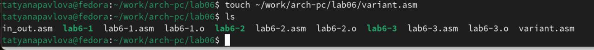{#fig:014 width=70%}

Внимательно изучите текст программы из листинга 6.4 и введите в файл variant.asm. (рис. [-@fig:015]).

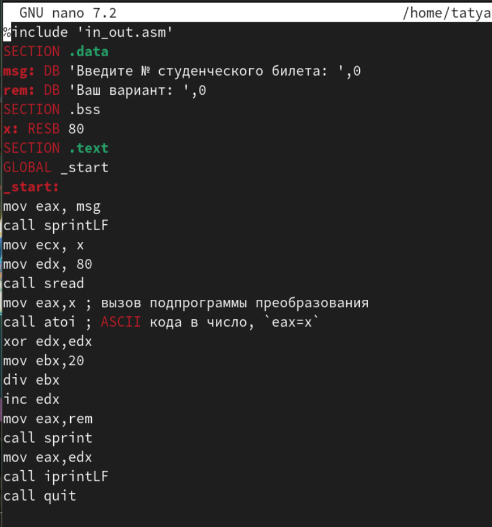{#fig:015 width=70%}

Создайте исполняемый файл и запустите его. Проверьте результат работы программы вычислив номер варианта аналитически. (рис. [-@fig:016]).

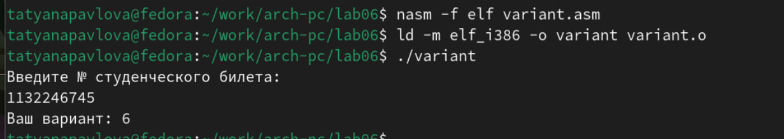{#fig:016 width=70%}

## Ответы на вопросы

Включите в отчет по выполнению лабораторной работы ответы на следующие вопросы:

1. Какие строки листинга 6.4 отвечают за вывод на экран сообщения ‘Ваш вариант:’?

За вывод сообщения “Ваш вариант” отвечают строки кода:
mov eax,rem
call sprint

2. Для чего используется следующие инструкции?
mov ecx, x
mov edx, 80
call sread

Инструкция mov ecx, x используется, чтобы положить адрес вводимой строки x в регистр ecx mov edx, 80 - запись в регистр edx длины вводимой строки call sread - вызов подпрограммы из внешнего файла, обеспечивающей ввод сообщения с клавиатуры

3. Для чего используется инструкция “call atoi”?

"call atoi" используется для вызова подпрограммы из внешнего файла, которая преобразует ascii-код символа в целое число и записывает результат в регистр eax

4. Какие строки листинга 6.4 отвечают за вычисления варианта?

За вычисления варианта отвечают строки:
xor edx,edx ; обнуление edx для корректной работы div
mov ebx,20 ; ebx = 20
div ebx ; eax = eax/20, edx - остаток от деления
inc edx ; edx = edx + 1

5. В какой регистр записывается остаток от деления при выполнении инструкции “div ebx”?

При выполнении инструкции "div ebx" остаток от деления записывается в регистр edx

6. Для чего используется инструкция “inc edx”?

Инструкция "inc edx" увеличивает значение регистра edx на 1

7. Какие строки листинга 6.4 отвечают за вывод на экран результата вычислений?

За вывод на экран результатов вычислений отвечают строки:
mov eax,edx
call iprintLF

# Выполнение заданий для самостоятельной работы

Создаю файл lab6-4.asm с помощью утилиты touch (рис. [-@fig:017]).

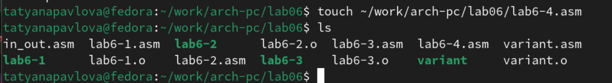{#fig:017 width=70%}

Открываю созданный файл для редактирования, ввожу в него текст программы для вычисления значения выражения 𝑥^^3/2 + 1. Это выражение было под вариантом 15. (рис. [-@fig:018]).

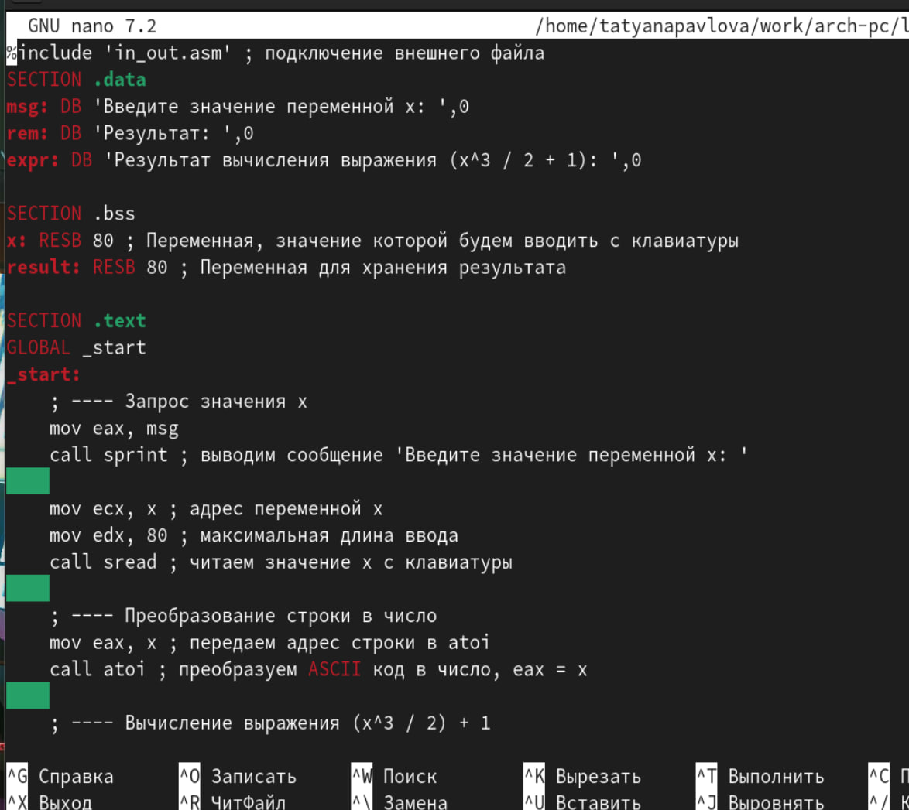{#fig:018 width=70%}

Создаю и запускаю исполняемый файл. 

При вводе значения 2, вывод — 5. (рис. [-@fig:019]).

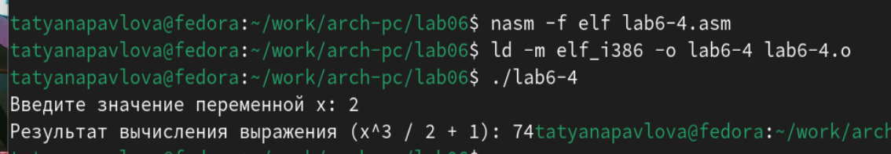{#fig:019 width=70%}

При вводе значения 5, вывод — 63,5. (рис. [-@fig:020]).

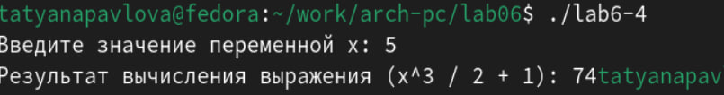{#fig:020 width=70%}

# Выводы

При выполнении данной лабораторной работы я освоила арифметические инструкции языка ассемблера NASM.

# Список литературы{.unnumbered}

1. GDB: The GNU Project Debugger. — URL: https://www.gnu.org/software/gdb/.
2. GNU Bash Manual. — 2016. — URL: https://www.gnu.org/software/bash/manual/.
3. Midnight Commander Development Center. — 2021. — URL: https://midnight-commander. Org/.
4. NASM Assembly Language Tutorials. — 2021. — URL: https://asmtutor.com/.
5. Newham C. Learning the bash Shell: Unix Shell Programming. — O’Reilly Media, 2005. — 354 с. — (In a Nutshell). — ISBN 0596009658. — URL: http://www.amazon.com/Learningbash-Shell-Programming-Nutshell/dp/0596009658.
6. Robbins A. Bash Pocket Reference. — O’Reilly Media, 2016. — 156 с. — ISBN 978-1491941591.
7. The NASM documentation. — 2021. — URL: https://www.nasm.us/docs.php.
8. Zarrelli G. Mastering Bash. — Packt Publishing, 2017. — 502 с. — ISBN 9781784396879.
9. Колдаев В. Д., Лупин С. А. Архитектура ЭВМ. — М. : Форум, 2018.
10. Куляс О. Л., Никитин К. А. Курс программирования на ASSEMBLER. — М. : Солон-Пресс, 2017.
11. Новожилов О. П. Архитектура ЭВМ и систем. — М. : Юрайт, 2016.
12. Расширенный ассемблер: NASM. — 2021. — URL: https://www.opennet.ru/docs/RUS/nasm/.
13. Робачевский А., Немнюгин С., Стесик О. Операционная система UNIX. — 2-е изд. — БХВПетербург, 2010. — 656 с. — ISBN 978-5-94157-538-1.
14. Столяров А. Программирование на языке ассемблера NASM для ОС Unix. — 2-е изд. — М. : МАКС Пресс, 2011. — URL: http://www.stolyarov.info/books/asm_unix.
15. Таненбаум Э. Архитектура компьютера. — 6-е изд. — СПб. : Питер, 2013. — 874 с. — (Классика Computer Science).
16. Таненбаум Э., Бос Х. Современные операционные системы. — 4-е изд. — СПб. : Питер, 2015. — 1120 с. — (Классика Computer Science). 

